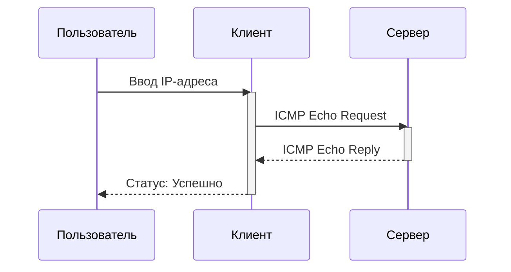
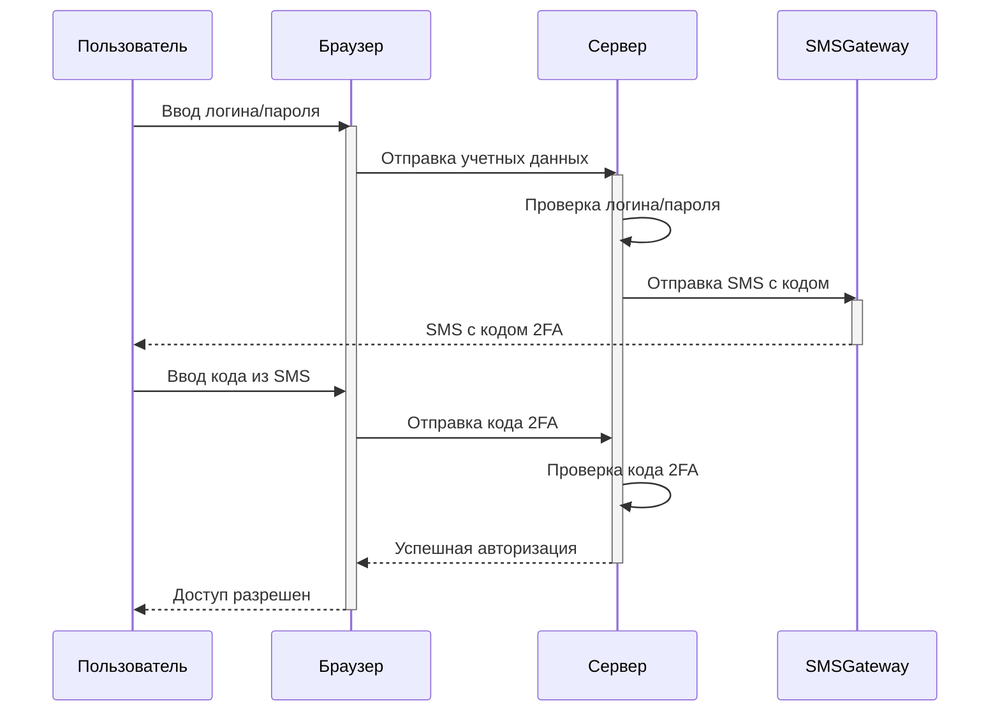
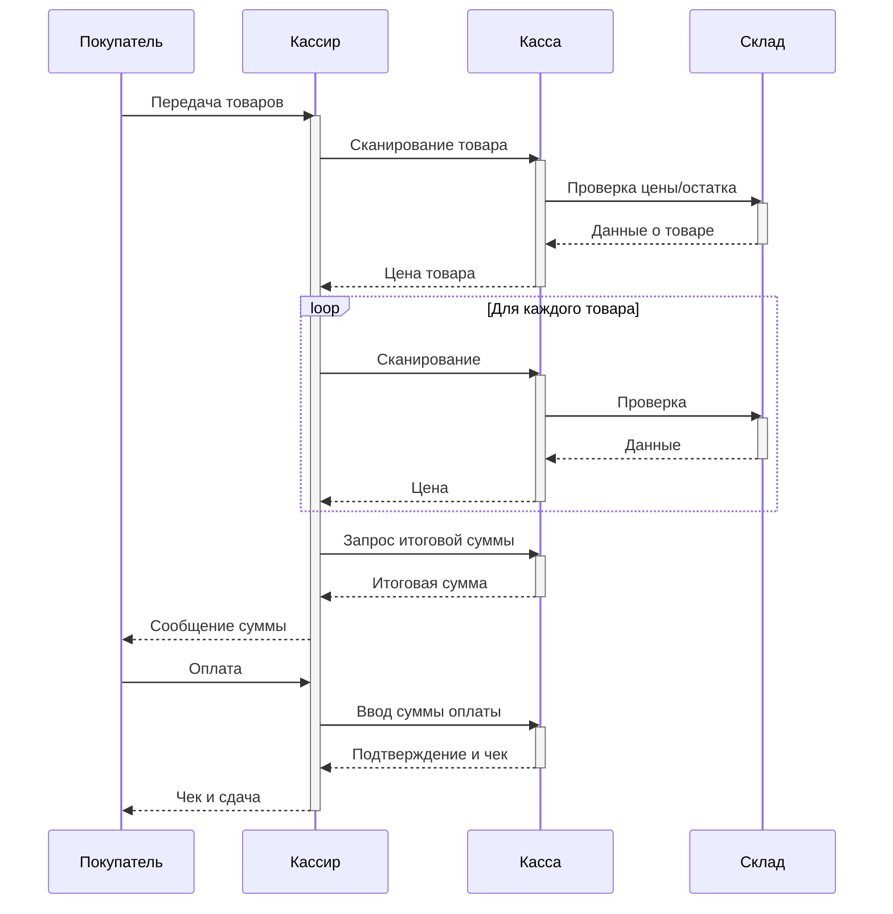
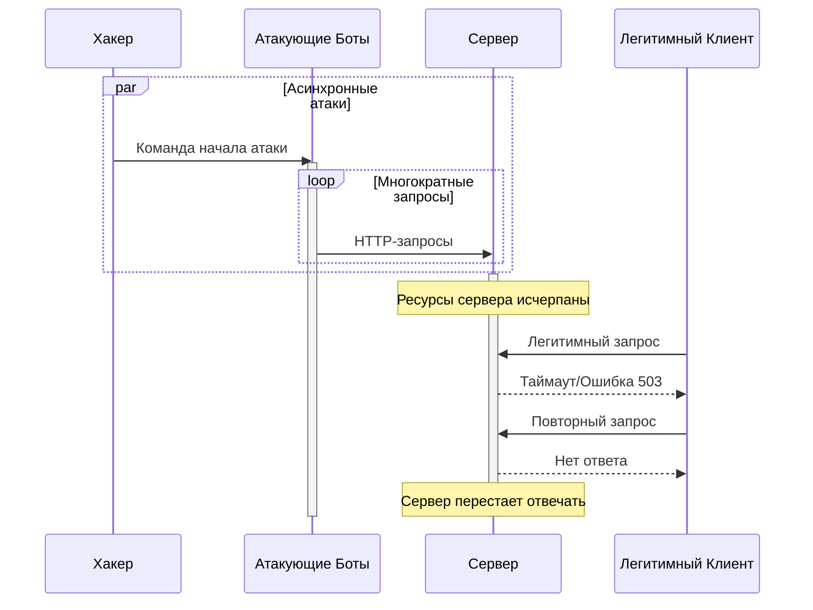

#Выполнил Катыров Радмир 323 СА/1
#Проверил Яковенко Евгений Романович

Задание 1:

```mermaid
sequenceDiagram
    participant Пользователь
    participant Клиент
    participant Сервер
    Пользователь->>Клиент: Ввод IP-адреса
    activate Клиент
    Клиент->>Сервер: ICMP Echo Request
    activate Сервер
    Сервер-->>Клиент: ICMP Echo Reply
    deactivate Сервер
    Клиент-->>Пользователь: Статус: Успешно
    deactivate Клиент
```

Задание 2:

```mermaid
sequenceDiagram
    participant Пользователь
    participant Браузер
    participant Сервер
    participant SMSGateway
    Пользователь->>Браузер: Ввод логина/пароля
    activate Браузер
    Браузер->>Сервер: Отправка учетных данных
    activate Сервер
    Сервер->>Сервер: Проверка логина/пароля
    Сервер->>SMSGateway: Отправка SMS с кодом
    activate SMSGateway
    SMSGateway-->>Пользователь: SMS с кодом 2FA
    deactivate SMSGateway
    Пользователь->>Браузер: Ввод кода из SMS
    Браузер->>Сервер: Отправка кода 2FA
    Сервер->>Сервер: Проверка кода 2FA
    Сервер-->>Браузер: Успешная авторизация
    deactivate Сервер
    Браузер-->>Пользователь: Доступ разрешен
    deactivate Браузер
```

Задание 3:

```mermaid
sequenceDiagram
    participant Покупатель
    participant Кассир
    participant Касса
    participant Склад
    Покупатель->>Кассир: Передача товаров
    activate Кассир
    Кассир->>Касса: Сканирование товара
    activate Касса
    Касса->>Склад: Проверка цены/остатка
    activate Склад
    Склад-->>Касса: Данные о товаре
    deactivate Склад
    Касса-->>Кассир: Цена товара
    deactivate Касса
    loop Для каждого товара
        Кассир->>Касса: Сканирование
        activate Касса
        Касса->>Склад: Проверка
        activate Склад
        Склад-->>Касса: Данные
        deactivate Склад
        Касса-->>Кассир: Цена
        deactivate Касса
    end
    Кассир->>Касса: Запрос итоговой суммы
    activate Касса
    Касса-->>Кассир: Итоговая сумма
    deactivate Касса
    Кассир-->>Покупатель: Сообщение суммы
    Покупатель->>Кассир: Оплата
    Кассир->>Касса: Ввод суммы оплаты
    activate Касса
    Касса-->>Кассир: Подтверждение и чек
    deactivate Касса
    Кассир-->>Покупатель: Чек и сдача
    deactivate Кассир
```

Задание 4:

```mermaid
sequenceDiagram
    participant Хакер
    participant Атакующие Боты
    participant Сервер
    participant Легитимный Клиент
    par Асинхронные атаки
        Хакер->>Атакующие Боты: Команда начала атаки
        activate Атакующие Боты
        loop Многократные запросы
            Атакующие Боты->>Сервер: HTTP-запросы
        end
    end
    activate Сервер
    Note over Сервер: Ресурсы сервера исчерпаны
    Легитимный Клиент->>Сервер: Легитимный запрос
    Сервер-->>Легитимный Клиент: Таймаут/Ошибка 503
    Легитимный Клиент->>Сервер: Повторный запрос
    Сервер-->>Легитимный Клиент: Нет ответа
    Note over Сервер: Сервер перестает отвечать
    deactivate Сервер
    deactivate Атакующие Боты
```