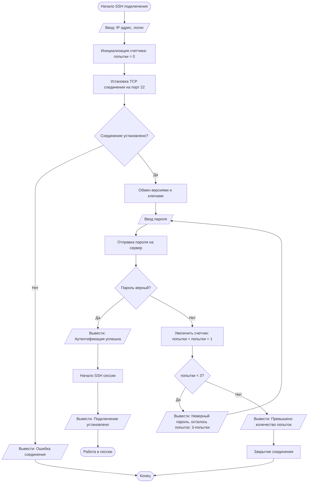

#Выполнил Катыров Радмир 323 СА/1
#Проверил Яковенко Евгений Романович

Задание 1:
```mermaid
flowchart TD
    A([Начало]) --> B[/Введите целевой IP-адрес/]
    B --> C[/Введите количество попыток/]
    C --> D[Инициализировать счетчик: i = 1]
    D --> E{i <= количество попыток?}
    E -- Да --> F[Отправить ICMP-запрос]
    F --> G{Получен ответ?}
    G -- Да --> H[Вывести: Успешный ping]
    G -- Нет --> I[Вывести: Таймаут]
    H & I --> J[Увеличить счетчик i++]
    J --> E
    E -- Нет --> K[/Вывести общую статистику/]
    K --> L([Конец])
   
 ```

Задание 2:
```mermaid
flowchart TD
    A([Начало]) --> B[/Ввод: исходный и целевой IP/]
    B --> C[Инициализация: текущий маршрутизатор = исходный]
    C --> D[Получить LSDB текущего маршрутизатора]
    D --> E[Запустить алгоритм Дейкстры для построения SPF дерева]
    E --> F[Определить следующий hop к цели]
    F --> G{Следующий hop найден?}
    G -- Нет --> H[/Вывести: Маршрут недоступен/]
    H --> Z([Конец])
    G -- Да --> I[Отправить сообщение следующему hop]
    I --> J{Сообщение достигло цели?}
    J -- Нет --> K[Обновить текущий_маршрутизатор]
    K --> D
    J -- Да --> L[/Вывести: Сообщение доставлено/]
    L --> Z
```

Задание 3:
