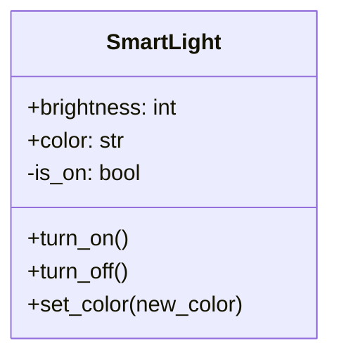
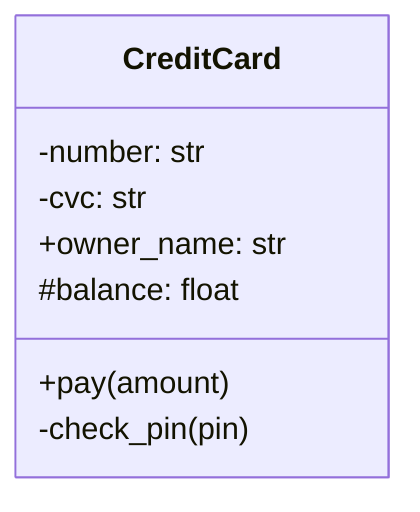
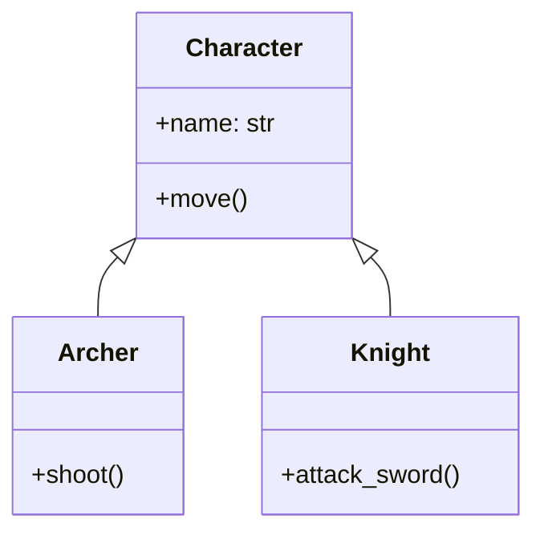
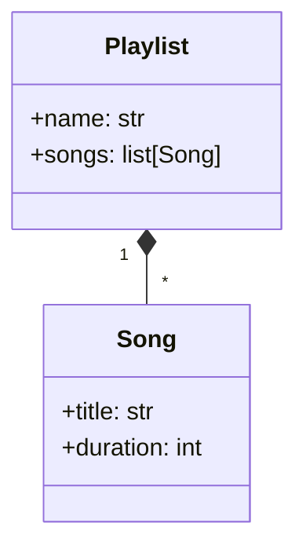
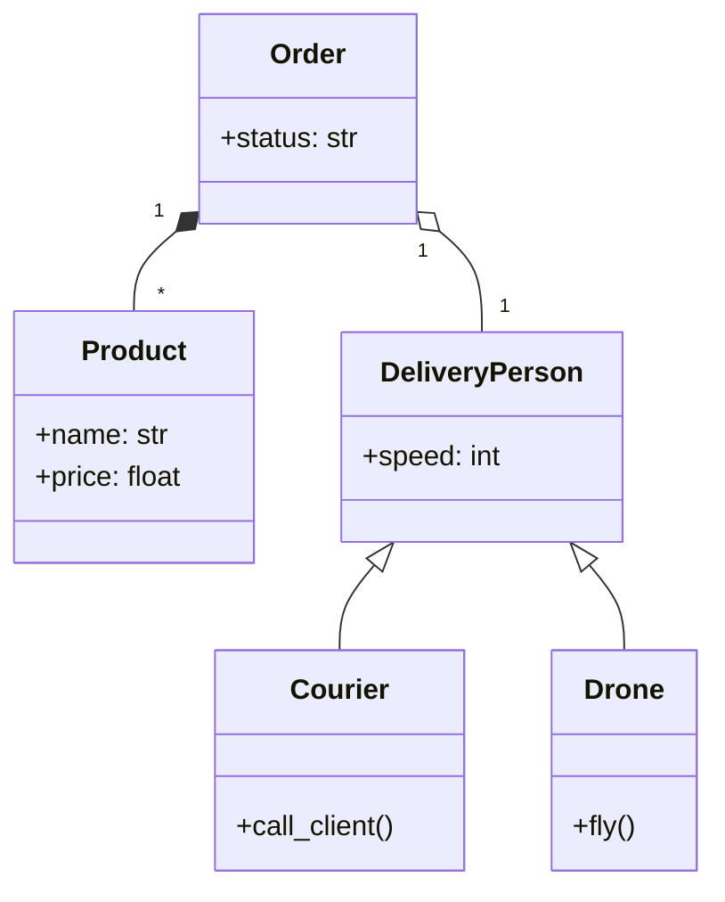
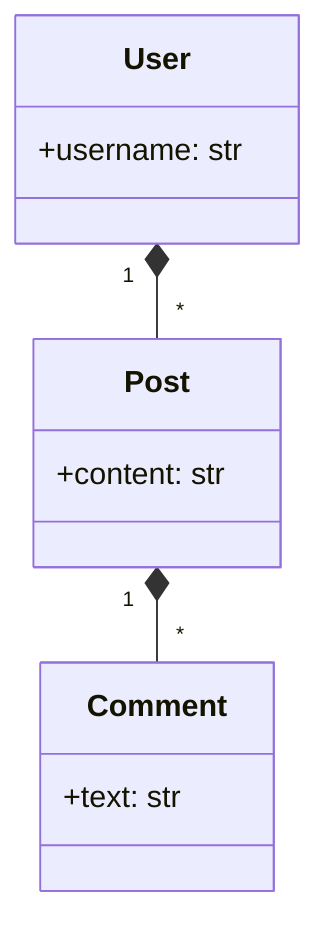

#Выполнил Катыров Радмир 323СА/1
#Проверил Яковенко Е.Р

#mermaid Задание 1

#mermaid Задание 2

#mermaid Задание 3

#mermaid Задание 4

#mermaid Задание 5

#mermaid Задание 6

Композиция User-Post, так как пост не существует без пользователя и композиция Post-Comment, так как комментарии удаляются с постом